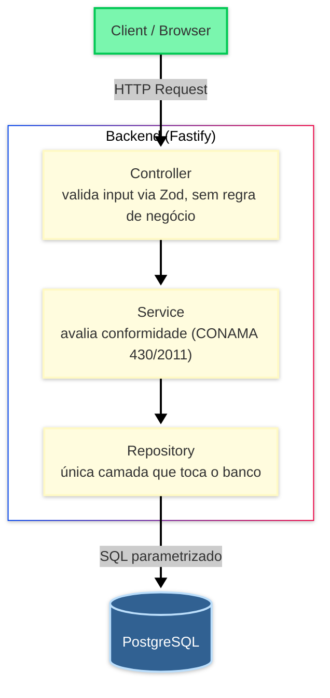

# 💧 HidroCompliance — Conformidade de Efluentes (CONAMA 430/2011)

> API REST e dashboard para registrar análises laboratoriais de efluentes industriais e avaliar sua conformidade contra os limites de lançamento da Resolução CONAMA nº 430/2011.

[](https://www.typescriptlang.org/)
[](https://fastify.dev/)
[](https://zod.dev/)
[](https://nextjs.org/)
[](https://www.postgresql.org/)

---

## 🔗 Live Demo

- **Frontend:** https://aps-effluent-mgt.vercel.app/
- **Backend:** https://aps-effluent-mgt.onrender.com
- **API Docs (Swagger):** https://aps-effluent-mgt.onrender.com/documentation

> ⚠️ Backend no Render free tier hiberna após ~15 min de inatividade — a primeira requisição após um período ocioso pode demorar. Veja [Known Limitations](#known-limitations).

---

## 📑 Table of Contents

- [About](#about)
- [Tech Stack](#tech-stack)
- [Architecture](#architecture)
- [Project Structure](#project-structure)
- [Getting Started](#getting-started)
- [Endpoints](#endpoints)
- [Frontend](#frontend)
- [Tests](#tests)
- [Seed Data](#seed-data)
- [Next Steps](#next-steps)
- [Known Limitations](#known-limitations)

---

## About

HidroCompliance é um projeto de **Atividades Práticas Supervisionadas (APS)** do curso de Ciência da Computação, com tema ligado a gestão ambiental / ISO 14001. Ele simula o monitoramento de efluentes industriais de uma estação de tratamento: análises laboratoriais periódicas de 6 parâmetros físico-químicos são registradas e comparadas automaticamente contra os limites de lançamento definidos pela **Resolução CONAMA nº 430/2011**.

O monorepo é dividido em dois pacotes:

- **`backend/`** — Web Service REST (Fastify) responsável por toda a regra de negócio: persistência das análises e avaliação de conformidade.
- **`frontend/`** — Dashboard Next.js, cliente puro da API. Não contém lógica de negócio nem calcula conformidade — apenas exibe o que a API retorna.

> ⚠️ **Aviso:** "ETE Vale do Rio Claro · Estação de tratamento de efluentes · Unidade Industrial II", exibido no cabeçalho do dashboard, é um nome **fictício/de exemplo**, criado apenas para fins didáticos deste projeto acadêmico (APS). Não corresponde a uma estação de tratamento real, e os dados de análise usados na demonstração são **gerados sinteticamente** (`pnpm seed`) — não refletem valores reais de nenhuma instalação existente.

---

## Tech Stack

### Backend
| Technology | Description |
|---|---|
| **TypeScript** | Modo estrito |
| **Fastify 5** | Framework HTTP |
| **Zod** | Validação de entrada/saída, convertida para JSON Schema (`z.toJSONSchema()`) para Fastify e Swagger |
| **pg (node-postgres)** | Driver PostgreSQL, SQL parametrizado |
| **node-pg-migrate** | Migrations versionadas |
| **@fastify/swagger** + **@fastify/swagger-ui** | Documentação OpenAPI gerada a partir dos mesmos schemas Zod |
| **@fastify/cors** + **@fastify/rate-limit** | CORS restrito à origem do frontend e rate limiting global |
| **Vitest** | Testes (rodam contra um PostgreSQL de teste real, não mockado) |
| **ESLint** | Lint |
| **PostgreSQL 16** | Banco de dados |

### Frontend
| Technology | Description |
|---|---|
| **Next.js 16 (App Router)** | Framework React |
| **TypeScript** | Modo estrito |
| **Tailwind CSS v4** | Estilização |
| **recharts** | Gráfico de tendência (série temporal) |
| **fetch nativo** | Sem biblioteca de data-fetching (sem TanStack Query) — chamadas via `lib/api-client.ts` |

---

## Architecture

O backend segue camadas simples, sem separação em domain/infra ao estilo Clean Architecture — decisão intencional para o escopo do projeto.



**Key decisions:**

- **Controller** (`src/controllers/`) — recebe a requisição HTTP, valida entrada com schema Zod, chama o Service e formata a resposta. Sem regra de negócio.
- **Service** (`src/services/`) — lógica de avaliação de conformidade (`evaluateCompliance`), orquestra chamadas ao Repository.
- **Repository** (`src/repositories/`) — única camada que toca o banco, com SQL sempre parametrizado.
- **Schemas** (`src/schemas/`) — validação Zod de entrada/saída, convertida para JSON Schema nativamente (`z.toJSONSchema()`) e reaproveitada tanto pela validação do Fastify quanto pela documentação Swagger — única fonte de verdade.
- **Domínio** (`src/domain/`) — a função pura `evaluateCompliance` (regras de conformidade) é compartilhada entre `POST /analyses` (persiste) e `POST /compliance/preview` (não persiste), evitando duplicar a regra de negócio.

---

## Project Structure

```
Aps-effluent-mgt/
├── backend/
│   ├── src/
│   │   ├── config/         # Validação de variáveis de ambiente
│   │   ├── controllers/    # Recebe requisição HTTP, valida via Zod, chama Service
│   │   ├── services/       # Regra de negócio (avaliação de conformidade)
│   │   ├── repositories/   # Única camada que toca o banco
│   │   ├── domain/         # evaluateCompliance + tabela de parâmetros/limites
│   │   ├── schemas/        # Schemas Zod (validação + geração de JSON Schema)
│   │   ├── db/             # Pool de conexão, schema, helpers de timestamp
│   │   ├── seed/           # Geração dos dados de demonstração
│   │   └── app.ts          # Fastify app factory (CORS, rate limit, Swagger, error handler)
│   ├── migrations/         # node-pg-migrate
│   └── docker-compose.yml  # PostgreSQL local
│
├── frontend/
│   ├── src/
│   │   ├── app/                  # Next.js App Router (dashboard principal)
│   │   ├── components/
│   │   │   ├── dashboard/        # KPI cards, parameter cards, trend chart, alerts feed, analyses table, sidebar/topbar
│   │   │   └── ui/                # Componentes de UI
│   │   └── lib/                  # api-client.ts (fetch tipado), types.ts
│   └── .env.example
│
└── .github/workflows/       # CI (lint + testes contra Postgres de teste)
```

---

## Getting Started

### Prerequisites
- Node.js 24+
- pnpm
- Docker (para o PostgreSQL local)

### 1. Clone the repository

```bash
git clone <repo-url>
cd Aps-effluent-mgt
```

### 2. Backend

```bash
cd backend

# Sobe o PostgreSQL local
docker compose up -d

# Instala dependências
pnpm install

# Configura variáveis de ambiente
cp .env.example .env

# Aplica as migrations
pnpm migrate

# Popula o banco com os dados de demonstração
pnpm seed

# Sobe o servidor de desenvolvimento
pnpm dev
```

API disponível em `http://localhost:3001` (porta configurável via `PORT`).
Documentação Swagger em `http://localhost:3001/documentation`.

### 3. Frontend

```bash
cd frontend

pnpm install
cp .env.example .env.local   # ajuste NEXT_PUBLIC_API_URL se necessário

pnpm dev
```

Dashboard disponível em `http://localhost:3000`.

---

## Endpoints

**Base URL:** `http://localhost:3001` (local) — sem prefixo `/api`.

| Method | Path | Descrição |
|--------|------|-------------|
| `GET` | `/parameters` | Lista os 6 parâmetros monitorados (pH, DBO, DQO, Temperatura, Sólidos Suspensos, Óleos e Graxas) com seus limites CONAMA 430/2011 |
| `GET` | `/analyses?days=7\|30\|90` | Lista as análises registradas no período, ordenadas por data decrescente |
| `GET` | `/series?param=<key>&days=7\|30\|90` | Série temporal de um parâmetro, ordenada por data crescente (dado do gráfico de tendência) |
| `GET` | `/kpis?days=7\|30\|90` | Total de análises, taxa de conformidade, parâmetros em alerta e última coleta no período |
| `GET` | `/alerts?days=7\|30\|90` | Análises não conformes do período |
| `POST` | `/analyses` | Registra uma nova análise e avalia conformidade (persiste). **Bloqueado em produção** (`403 WRITE_DISABLED_IN_PRODUCTION`) |
| `POST` | `/compliance/preview` | Avalia conformidade de um valor hipotético usando a mesma regra de `POST /analyses`, **sem persistir nada** — disponível em todos os ambientes |

Todos os endpoints com `days` exigem o parâmetro (`400 VALIDATION_ERROR` se ausente ou fora de `7`/`30`/`90`).

Erros seguem sempre o mesmo envelope:

```json
{ "error": { "message": "Descrição legível do erro", "code": "VALIDATION_ERROR" } }
```

Códigos possíveis: `VALIDATION_ERROR` (400), `WRITE_DISABLED_IN_PRODUCTION` (403), `NOT_FOUND` (404), `RATE_LIMITED` (429), `INTERNAL_ERROR` (500).

---

## Frontend

O dashboard exibe os dados retornados pela API em blocos independentes — a falha ou lentidão de um endpoint não derruba o dashboard inteiro (cada bloco tem seu próprio loading e tratamento de erro):

- **KPI cards** — total de análises, taxa de conformidade, parâmetros em alerta, última coleta
- **Parameter cards** — os 6 parâmetros monitorados e seus limites
- **Trend chart** (recharts) — série temporal de um parâmetro com linhas de referência dos limites
- **Alerts feed** — não conformidades recentes
- **Analyses table** — histórico de análises do período
- **Teste público de conformidade** — chama `POST /compliance/preview` para um visitante testar um valor hipotético sem alterar os dados reais do dashboard

A navegação lateral tem os itens **Análises**, **Histórico**, **Relatórios** e **Configurações** presentes mas desabilitados — a única seção implementada hoje é o Dashboard (ver [Next Steps](#next-steps)).

---

## Tests

24 arquivos de teste no backend (`pnpm test` dentro de `backend/`), rodando contra um PostgreSQL de teste real (sem mocks de banco), cobrindo:

- Regras de conformidade e casos de fronteira (`src/domain/compliance.test.ts`) — ex.: pH exatamente 9 é conforme, temperatura exatamente 40°C não é (limite exclusivo)
- Controllers e services de cada endpoint (`GET /parameters`, `/analyses`, `/series`, `/kpis`, `/alerts`, `POST /analyses`, `POST /compliance/preview`)
- Repository (`src/repositories/analyses.repository.test.ts`)
- `POST /analyses` retornando `403 WRITE_DISABLED_IN_PRODUCTION` quando `NODE_ENV=production`, e funcionando normalmente em `development`/`test`
- `POST /compliance/preview` não inserindo nenhuma linha na tabela `analyses`
- Geração do seed (`src/seed/generate.test.ts`, `src/seed/run.test.ts`)

CI (GitHub Actions) roda lint (ESLint) e os testes com cobertura (`pnpm test -- --coverage`) em push/PR contra um PostgreSQL de serviço, sem deploy automatizado.

---

## Seed Data

`pnpm seed` gera **90 dias de histórico** de análises, cobrindo os **6 parâmetros da Resolução CONAMA 430/2011** (pH, DBO 5 dias, DQO, Temperatura, Sólidos Suspensos, Óleos e Graxas), totalizando **540 análises**. A distribuição inclui deliberadamente algumas não conformidades em **DQO** e **Óleos e Graxas**, para que o feed de alertas e a taxa de conformidade não fiquem vazios/perfeitos na demonstração.

---

## Next Steps

- [ ] **Análises** — tela dedicada de listagem/gestão de análises (item de sidebar hoje desabilitado)
- [ ] **Histórico** — visão histórica além do dashboard atual (item de sidebar hoje desabilitado)
- [ ] **Relatórios** — geração de relatórios de conformidade (item de sidebar hoje desabilitado)

---

## Known Limitations

### Sem autenticação
Este projeto não implementa autenticação/login — decisão de escopo tomada desde o início do projeto, não uma lacuna. Em vez de login, o ambiente de produção restringe o que pode ser feito: `POST /analyses` (que persiste dados de verdade) é **desabilitado em produção** (`403 WRITE_DISABLED_IN_PRODUCTION`) justamente para não exigir autenticação e, ao mesmo tempo, evitar que um visitante polua os dados de demonstração. Quem quiser testar o funcionamento do sistema publicamente usa `POST /compliance/preview`, que avalia conformidade com a mesma regra de negócio mas **não persiste nada**.

### Cold start no Render (free tier)
O backend está hospedado no Render free tier, que hiberna a aplicação após ~15 minutos de inatividade. A primeira requisição após esse período demora mais (cold start) enquanto a instância sobe novamente.

### Suspensão de compute no Neon (free tier)
O banco de dados PostgreSQL está hospedado no Neon free tier, que suspende o compute quando ocioso. Isso não causa perda de dados — apenas torna a primeira consulta após um período ocioso mais lenta, enquanto o compute é religado.

⭐ Se este projeto te ajudou, deixe uma estrela!
